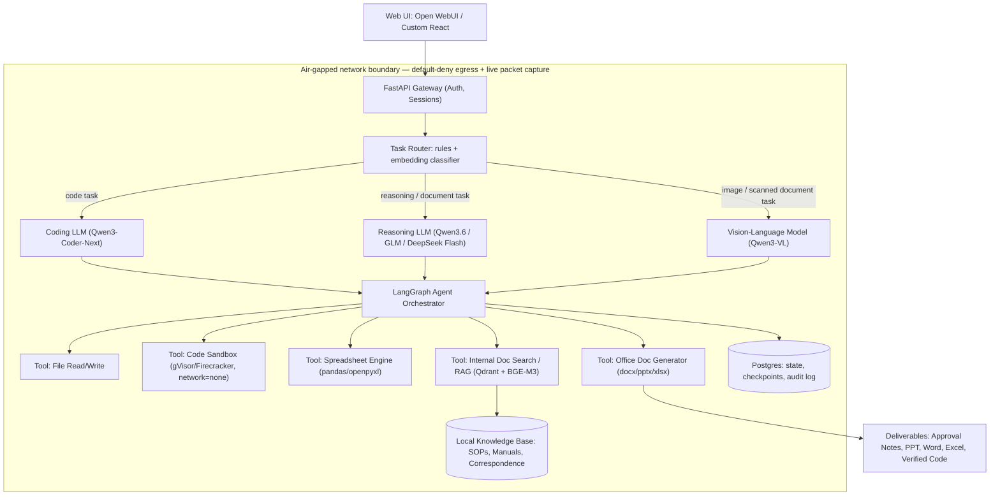
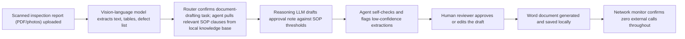

# Sovereign On-Premise Agentic AI Workbench for Confidential Industrial Work

*A technical build proposal — August 2026*

---

## 1. The Core Idea, Restated

Give refineries, PSUs, defence-linked manufacturers, and government offices a Claude/Codex-style AI assistant that **never leaves their network**, that **automatically picks the right open-weight model for each task**, that **acts like an agent** (plans, uses tools, iterates), and that **produces real files** — Word approval notes, PPTs, Excel sheets, verified code — grounded in the organization's own SOPs and manuals. The whole point is to close the gap between "do it manually" and "quietly paste it into ChatGPT," which is the actual failure mode happening today in sensitive sectors.

Nothing here requires inventing new AI research. Every component below is mature, open-source, and already running in production somewhere. The genuine engineering work is **integration, routing, sandboxing, and proving the air-gap** — not model training.

---

## 2. Tech Stack

| Layer | Choice | Why |
|---|---|---|
| Inference engine | **vLLM** (primary) or **Ollama** (simplest for a single workstation demo) | OpenAI-compatible API, continuous batching, multi-model serving, quantization support (AWQ/GPTQ/GGUF) |
| Reasoning / general LLM | **Qwen3.6-27B** or **Qwen3.5-27B** (Apache 2.0) | Fits on one high-end consumer/workstation GPU at Q4/Q5; strong multilingual and document-synthesis quality; broadest deployable size range in the Qwen family |
| Coding LLM | **Qwen3-Coder-Next** (80B total / 3B active MoE) | Runs cheaply because only 3B parameters activate per token; native 256K context; official vLLM/SGLang deployment support |
| Vision-language / OCR model | **Qwen3-VL** (2B–32B variants) or **Qwen2.5-VL** | Purpose-built OCR mode for scanned documents, tables, handwriting, skewed/degraded scans; open weight; strong document-understanding benchmarks (OmniDocBench, CC-OCR) |
| Embedding model | **BGE-M3** or **multilingual-e5** | Open weight, strong multilingual retrieval — matters for Hindi/regional-language SOPs |
| Heavier reasoning tier (optional, multi-GPU) | **DeepSeek-V4 Flash**, **GLM-5.x**, or **Qwen3.6-397B-A17B** | For sites with a real GPU cluster; not needed for the hackathon-scale demo |
| Router / model-selection layer | Custom **FastAPI** service: rule-based (file type, keywords) + embedding-similarity classifier, modeled on "training-free" routing approaches | Avoids needing labelled preference data on day one; swappable later for a learned router (RouteLLM-style) without touching the rest of the system |
| Agent orchestration | **LangGraph** | Stateful graph execution, built-in checkpointing (Postgres/Redis), time-travel/replay, and native human-in-the-loop approval steps — the property that actually matters for a regulated approval workflow |
| Local knowledge base / RAG | **LlamaIndex** or **Haystack** + **Qdrant** (self-hosted vector DB) | Grounds answers in the organization's own SOPs, manuals, and correspondence; Qdrant is a common self-hosted choice in air-gapped enterprise RAG stacks |
| Code execution sandbox | **gVisor** or **Firecracker microVM**, `--network=none`, read-only root FS, capability drop, resource limits (Docker+`--network=none` as a lighter fallback for the demo) | Treats LLM-generated code as hostile by default; this is the current industry-standard posture for agent code execution |
| Office-document generation | **python-docx**, **python-pptx**, **openpyxl** | Deterministic, auditable generation of the actual deliverables the org needs |
| OCR fallback for pure text scans | **Tesseract** / **PaddleOCR** | Cheap fallback for high-volume plain-text pages, keeps the VLM budget for genuinely visual content (drawings, handwriting, diagrams) |
| Frontend | **Open WebUI** (fastest to stand up, multi-user, chat-first) or a custom **React** app | Open WebUI's built-in RAG is "chat-first, light-RAG-second" — fine for chat, but the real RAG grounding should sit in the LlamaIndex+Qdrant layer behind it |
| State / audit store | **PostgreSQL** | LangGraph checkpoints, tool-call logs, human-approval audit trail — this is what makes the system defensible in a compliance review |
| Containerization | **Docker Compose** for the demo, **Kubernetes (k3s)** with network policies (Cilium/Calico) for production | Zero-egress network policy is enforced at the cluster level, not just by convention |
| Network proof layer | `iptables`/`nftables` default-deny egress, `tcpdump`/Wireshark live capture, optional physical NIC disconnect | This is the actual deliverable of the "sovereign" claim — see Section 6 |

**Hardware for the demo:** one workstation with a single **RTX 4090 (24 GB)** or similar. At 4-bit quantization, a 27B reasoning model, a small-active-parameter coding MoE, and a compact vision-language model can all be time-shared on one card via vLLM/Ollama's model-swap or served concurrently if VRAM allows a smaller VL variant (2B–8B). Scale to **4–8× A100/H100** only if the organization wants the larger MoE reasoning tiers (DeepSeek-V4, GLM-5.x) — not required to prove the concept.

---

## 3. How to Build It — Practical Path

1. **Stand up the inference layer first.** Install vLLM (or Ollama for speed of setup), pull 2–3 quantized open-weight models covering reasoning, coding, and vision. Confirm each is reachable via an OpenAI-compatible endpoint. Do this before writing a single line of agent code — it de-risks the hardest unknown (does the hardware actually run these models at usable speed).
2. **Build the router as a thin, swappable service.** Start dumb: file-extension and keyword rules (`.pdf`/`.jpg` → vision model, "write a script"/"debug" → coding model, everything else → reasoning model), backed by an embedding-similarity fallback for ambiguous queries. Wrap this behind one function call so it can be replaced by a trained classifier later without touching the orchestrator.
3. **Wire up LangGraph** with tool nodes: file I/O, sandboxed code execution, RAG search, spreadsheet ops, and document generation. Add a Postgres checkpointer immediately — it gives you the audit trail for free and lets you demo "resume after interruption."
4. **Stand up the knowledge base connector.** Ingest a sample set of SOPs/manuals into Qdrant via LlamaIndex with BGE-M3 embeddings. Keep chunking simple (retrieval quality matters more than model size for RAG).
5. **Add the human-in-the-loop checkpoint.** For any output that becomes an "approval note" or similar formal artifact, the graph should pause for a reviewer's explicit sign-off before the file is finalized. This is both good engineering and the honest answer to "can we trust this."
6. **Build the office-document output tools** (python-docx/pptx/openpyxl) as LangGraph tools, not as an afterthought — test these early since formatting fidelity is where these builds usually lose credibility.
7. **Lock the network down last, and prove it.** Default-deny egress firewall, then run the full demo with a live packet capture on screen. This is the single most persuasive part of a "sovereign AI" pitch — don't just claim it, show zero packets leaving.
8. **Only after the above works**, add a second model per task category and demonstrate the router actually discriminating between them.

---

## 4. Methodology — Architecture and Flow

### 4.1 System architecture

### 4.2 End-to-end demo flow (worked example: scanned inspection report → approval note)

### 4.3 Suggested build phases

| Phase | Duration (indicative) | Outcome |
|---|---|---|
| 1. Inference + single-model chat | Days 1–3 | One open-weight model answering questions locally |
| 2. Router + 2nd/3rd model | Days 4–6 | Demonstrable model auto-selection across task types |
| 3. Agent + tools (file I/O, sandbox, RAG) | Days 7–11 | Multi-step task carried through end to end |
| 4. Document generation + human approval step | Days 12–14 | Real Word/PPT/Excel output, reviewer sign-off |
| 5. Network lockdown + proof instrumentation | Days 15–16 | Live packet capture showing zero egress |
| 6. Hardening, additional models, polish | Ongoing | New models added via config, not redesign |

---

## 5. Difficulty

**Overall: Medium for a working prototype, High for a production-grade sovereign deployment.**

| Component | Difficulty | Why |
|---|---|---|
| Serving open-weight models locally | Low–Medium | vLLM/Ollama are mature; mostly a hardware-fit exercise |
| Task router | Medium | Rule + embedding-similarity routers are easy to stand up; getting them *reliably right* across many task types is an ongoing tuning problem |
| Agentic orchestration | Medium | LangGraph handles the hard state-management parts; your job is designing good tool boundaries |
| OCR/vision on real industrial documents | **High** | Degraded scans, handwriting, and non-standard P&ID conventions are still a genuine weak spot for every current VLM |
| Code execution sandboxing | Medium–High | Not conceptually hard, but easy to get wrong in a way that only shows up under adversarial input |
| Office-document generation | Low–Medium | Well-trodden libraries, but formatting fidelity takes iteration |
| Proving zero-egress convincingly | Low (engineering), High (discipline) | Technically simple; requires consistent enforcement across every component, including any library that silently phones home |
| Model lifecycle management | Medium | This space releases new frontier open-weight models roughly monthly — the router/registry has to be designed for swap-in, not fixed-in |

---

## 6. Feasibility Analysis

**Technical feasibility is high.** Every layer already exists as production software: vLLM/Ollama for serving, LangGraph for orchestration, Qdrant for vector search, Open WebUI for the front end, and Qwen/DeepSeek/GLM/Gemma model families cover reasoning, coding, and vision at sizes that run on a single workstation GPU. Fully air-gapped deployments of comparable stacks already exist at meaningful scale — for example, self-hosted RAG platforms have been deployed fully air-gapped on local GPUs for tens of thousands of users at a university. The novelty here isn't the AI research; it's the integration plus the compliance-grade audit/approval layer plus the India-specific policy fit.

**Economic feasibility is favorable and improving.** A single-GPU demo is inexpensive. At production scale, the Indian government's own IndiaAI Mission is actively subsidizing exactly this kind of infrastructure — the Mission has deployed roughly 34,000 GPUs accessible to registered organizations at heavily subsidized rates, and has identified 20 sovereign foundation-model proposals (12 large multimodal models, 8 small language models) for support. A PSU or government office building on this idea is pushing in the same direction the national policy is already funding, which materially de-risks the "who pays for the GPUs" question.

**Regulatory/policy feasibility is strong.** India's Digital Personal Data Protection Act pushes toward data residency, and the IndiaAI Mission's own stated rationale is reducing dependence on foreign AI supply chains for exactly the sectors named in this proposal (governance, strategic industry). This idea is not fighting policy headwinds — it is a direct instance of the stated national direction.

**The honest caveat:** feasibility is about *integration engineering*, not *invention*. That's a feature for a working prototype (nothing to wait on), but it also means the differentiator has to be execution quality — routing that actually works, OCR that's honest about its confidence, and a genuinely airtight network boundary — not the presence of any single novel component.

---

## 7. Potential Challenges and Risks — and How to Address Them

| Risk | Why it happens | Mitigation |
|---|---|---|
| **Misrouting** — task sent to the wrong model | Rule-based/embedding routers are imperfect, especially on mixed-intent queries | Start with a hybrid rule + embedding-similarity router (training-free, no labelled data needed); log every routing decision; add a manual override; only invest in a learned router once you have real usage data |
| **GPU memory pressure** from running multiple models | Reasoning + coding + vision models compete for VRAM on a single card | Use quantization (AWQ/GGUF Q4), prefer MoE models with small active-parameter counts (e.g., 3B active out of 80B), and let vLLM/Ollama swap models rather than holding all resident |
| **OCR/vision failures on real scans** — handwriting, faded ink, non-standard drawing symbols | Even state-of-the-art open VLMs struggle with degraded industrial documents; visual conventions vary by manufacturer and era | Treat VLM output as a *draft extraction*, not ground truth; attach confidence flags; route low-confidence regions to a human reviewer before they reach the approval note; keep a classical OCR fallback for plain text |
| **Unsafe code execution** — LLM-generated code doing something destructive | LLM-authored code should be treated as untrusted by default | gVisor/Firecracker microVM isolation, `--network=none`, capability drops, immutable filesystem, resource caps — this is now the accepted baseline for agent code execution, not an edge-case precaution |
| **Hallucinated or overconfident outputs feeding into approval decisions** | LLMs will produce fluent, wrong answers if not grounded | RAG-grounding against the org's own SOPs with source attribution; a mandatory human-approval checkpoint before any generated note is treated as final, not optional |
| **Proving the air-gap claim under scrutiny** | A stated policy ("we don't call the internet") is not the same as a demonstrated one | Default-deny egress firewall enforced at the network layer (not just app config), live packet capture visible during the demo, and — for the venue demo — an actual physical disconnect from any WAN uplink |
| **Fast model churn** | Open-weight leaderboards have reshuffled multiple times within 2026 alone (Qwen3.5→3.6→3.8, DeepSeek V3→V4, GLM 4.7→5.2) | Design the router against an OpenAI-compatible endpoint abstraction so a new model is a config entry, not a code change — this directly satisfies the "addable later without redesign" requirement |
| **License traps** | "Open weight" does not always mean freely deployable — some licenses restrict geography, commercial use, or user counts | Maintain a vetted allow-list favoring clearly permissive licenses (Apache 2.0/MIT-family models), and have a legal/compliance check-off before any model reaches production |
| **User adoption / trust** | People default back to manual work or public tools out of habit, not malice | Pilot in one department with a workflow the assistant clearly speeds up (e.g., first-draft approval notes), integrate into the existing sign-off process rather than replacing it, and make the "why this is safe to use" story (the network proof) visible to users, not just auditors |

---

## 8. Potential Impact on the Target Audience

The target users are the people currently caught between two bad options: doing routine-but-sensitive knowledge work entirely by hand, or quietly pasting confidential material (P&IDs, financials, unreleased designs, internal correspondence) into a public AI tool because company policy has no sanctioned alternative. That second behavior is a real, already-happening risk, not a hypothetical — and it's the actual problem this idea is aimed at.

For engineers, approvers, and analysts in refineries, PSUs, defence-linked manufacturing, and government offices, a working version of this system means:
- Faster first drafts of approval notes, inspection summaries, and board material, without the confidentiality trade-off.
- A sanctioned way to get AI help with scanned/handwritten documents that currently require fully manual transcription.
- A coding assistant for internal tools that never has to touch a cloud endpoint.
- An audit trail (who approved what, grounded in which SOP clause) that manual work and ad hoc cloud-tool use never provided in the first place.

For the organization, the impact is closing an active security gap (unsanctioned use of public AI tools with confidential data) by giving people a legitimate alternative that's actually convenient enough to use.

---

## 9. Benefits

- **Security/strategic:** Removes the incentive to paste confidential P&IDs, financials, or defence-related designs into third-party cloud tools — directly closing the "shadow AI" leakage risk described in the problem statement.
- **Economic:** Avoids recurring per-token cloud API spend at scale; captures productivity currently lost to fully manual documentation work; production-scale GPU costs are softened by IndiaAI Mission's subsidized compute access for eligible organizations.
- **Social/national:** Builds in-house sovereign AI operating capability rather than dependency on foreign AI vendors, aligned with — and able to draw on — India's broader sovereign AI push (IndiaAI Mission, BharatGen, DPDP Act data-residency direction).
- **Compliance:** Produces an audit trail (source-grounded drafts, human sign-off, network logs) that neither fully manual work nor unsanctioned cloud-tool use currently provides.
- **Environmental — with an honest caveat:** Running right-sized, quantized, small-active-parameter models on demand can use materially less energy than always routing every query to an oversized frontier model. This benefit is *not automatic* — it depends on responsible model sizing and utilization; an idle multi-GPU cluster provisioned for peak load has real power and cooling costs of its own, so this should be presented as a design goal (right-size the model to the task via routing) rather than a guaranteed outcome.

---

## 10. References and Further Reading

**Open-weight models and licensing**
- Qwen3-VL (vision-language, OCR-focused) — https://github.com/qwenlm/qwen3-vl
- Qwen2.5-VL Technical Report (document/OCR benchmarks) — https://arxiv.org/pdf/2502.13923
- Qwen2-VL paper — https://arxiv.org/pdf/2409.12191
- Best Open-Weight LLMs 2026 comparison (DeepSeek vs Qwen vs Kimi vs GLM vs Llama, license/hardware trade-offs) — https://wavect.io/blog/open-weight-llm-comparison-2026/
- Best Open-Source LLMs, updated July 2026 (model sizing guidance for on-prem) — https://acecloud.ai/blog/best-open-source-llms/

**Model routing (the "auto-select the right model" research base)**
- RouteLLM: Learning to Route LLMs with Preference Data — referenced via routing survey: https://arxiv.org/pdf/2505.16303
- Router-R1: multi-round LLM routing via reinforcement learning — https://arxiv.org/pdf/2506.09033
- Eagle: training-free multi-LLM router — https://arxiv.org/pdf/2409.15518
- LLMRouter open-source routing library (16+ routing strategies) — https://github.com/ulab-uiuc/LLMRouter
- Awesome AI Model Routing (curated list) — https://github.com/Not-Diamond/awesome-ai-model-routing

**Agent orchestration frameworks**
- LangGraph vs CrewAI vs AutoGen comparison — https://gurusup.com/blog/best-multi-agent-frameworks-2026
- Open-source agent framework comparison (LangGraph for regulated/auditable workflows) — https://www.digitalapplied.com/blog/open-source-agent-frameworks-5-compared-2026

**Self-hosted RAG and infrastructure**
- Self-Hosted RAG in 2026 — full guide, including air-gapped deployment examples — https://onyx.app/insights/self-hosted-rag
- Best Enterprise RAG Platforms for 2026 (ITAR/FedRAMP/CMMC-relevant configurations) — https://onyx.app/insights/enterprise-rag-platforms-2026
- Self-Hosted AI Stack 2026: Ollama, Open WebUI, n8n, Qdrant — https://meshworld.in/blog/ai/self-hosted-ai-stack-2026/
- Air-Gapped AI Memory for Enterprise Deployment — https://www.cognee.ai/blog/guides/air-gapped-memory-framework-enterprise

**Sandboxing / code execution security**
- How to sandbox AI agents in 2026: Firecracker, gVisor, isolation strategies — https://dev.to/manveerchawla/how-to-sandbox-ai-agents-in-2026-firecracker-gvisor-runtimes-isolation-strategies-14pk
- Agent Execution Sandbox guide — https://www.augmentcode.com/guides/agent-execution-sandbox
- Awesome Agent Runtime Security (curated list) — https://github.com/bureado/awesome-agent-runtime-security

**India sovereign AI policy context**
- IndiaAI Mission set to support 20 sovereign AI models (govt disclosure, July 2026) — https://cxotoday.com/governance/indiaai-mission-set-to-support-20-sovereign-ai-models/
- India Sovereign AI Status 2026: IndiaAI Mission, GPU access, gaps — https://explainx.ai/blog/india-sovereign-ai-status-indiaai-mission-2026
- India's AI Policy 2026: GPU procurement, DPDP Act, data sovereignty — https://valueaddvc.com/blog/indias-ai-policy-2026-gpu-procurement-data-sovereignty-and-startup-support
- Sovereign AI in 2026 landscape (BharatGen, IndiaAI Mission budget/rationale) — https://pdpspectra.com/blog/sovereign-ai-initiatives-2026/

*Note: this is a fast-moving field — open-weight model leaderboards have shifted multiple times within 2026 alone. Re-check current model rankings and licenses shortly before build/demo time, and keep the model layer behind an OpenAI-compatible abstraction so new releases are a config change, not a rebuild.*
